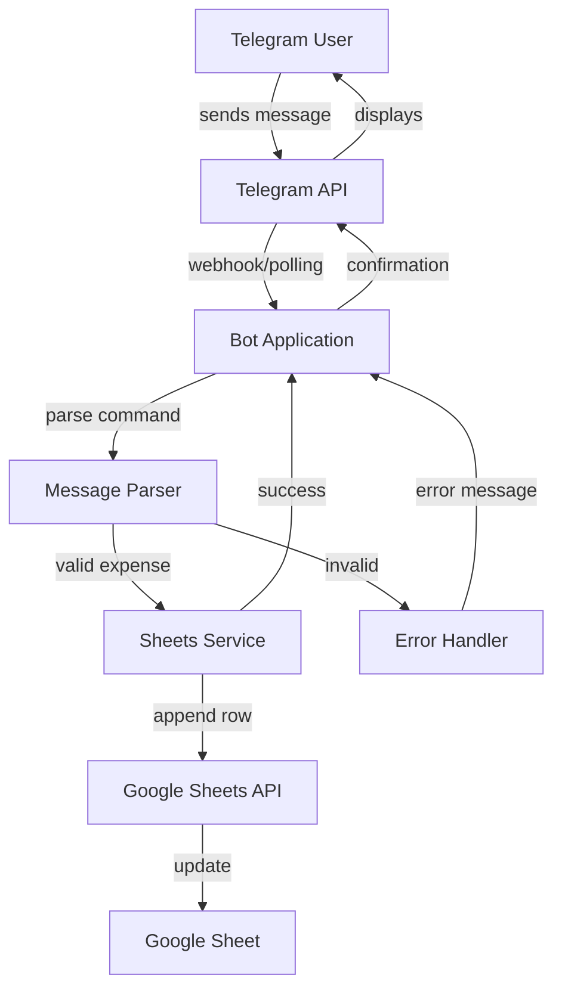
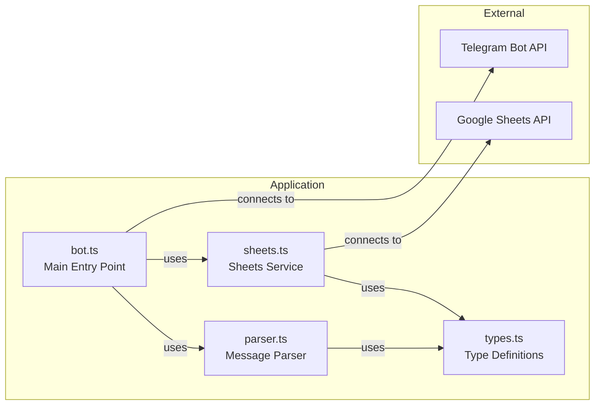
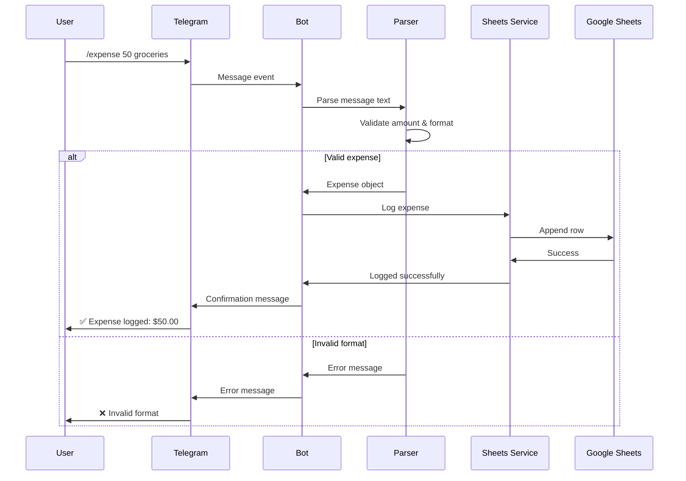
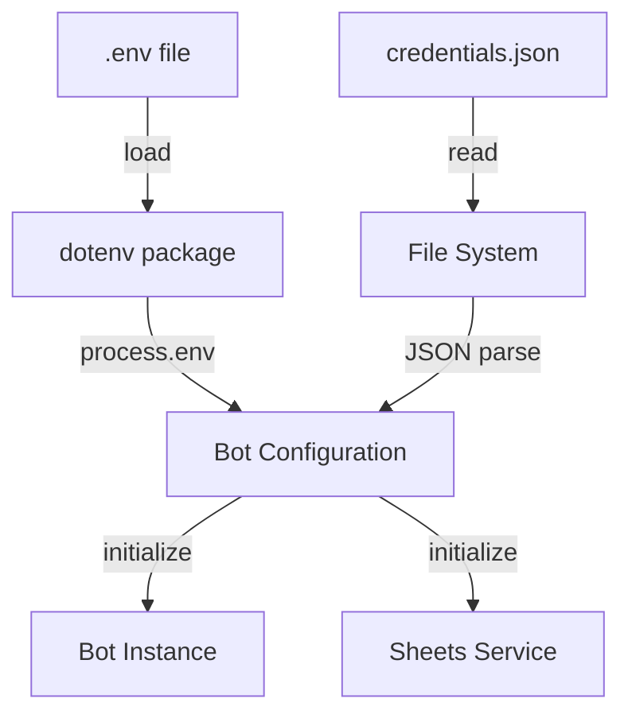
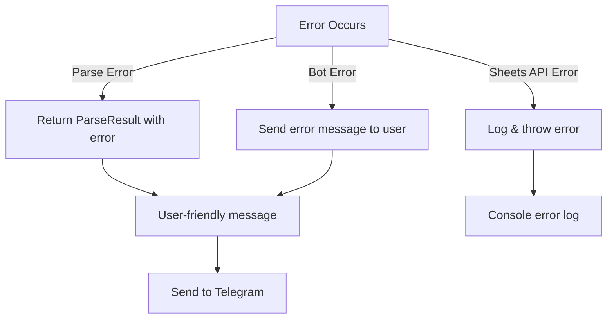
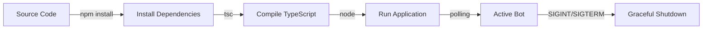
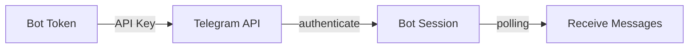
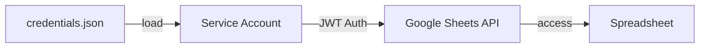
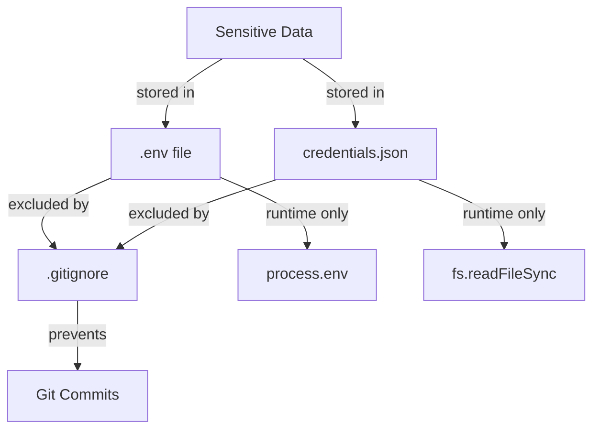

# Architecture Overview

## System Architecture

## Component Architecture

## Data Flow

## Module Responsibilities

### bot.ts
- **Purpose:** Main application entry point
- **Responsibilities:**
  - Initialize Telegram bot
  - Load configuration
  - Handle bot commands
  - Coordinate between parser and sheets service
  - Send responses to users

### parser.ts
- **Purpose:** Parse and validate expense messages
- **Responsibilities:**
  - Extract amount and description from text
  - Validate numeric amounts
  - Format dates
  - Return structured expense objects

### sheets.ts
- **Purpose:** Google Sheets integration
- **Responsibilities:**
  - Authenticate with Google API
  - Initialize sheet with headers
  - Append expense rows
  - Query expense data
  - Calculate totals

### types.ts
- **Purpose:** TypeScript type definitions
- **Responsibilities:**
  - Define Expense interface
  - Define BotConfig interface
  - Define ParseResult interface

### verify-setup.ts
- **Purpose:** Setup verification utility
- **Responsibilities:**
  - Check environment variables
  - Verify credentials file exists
  - Validate configuration
  - Provide helpful error messages

## Configuration Flow

## Error Handling Strategy

## Deployment Flow

## Authentication Flow

### Telegram

### Google Sheets

## Key Design Decisions

### 1. **Polling vs Webhooks**
- **Choice:** Polling
- **Reason:** Simpler setup, no need for public URL or SSL certificates
- **Trade-off:** Slightly higher latency but easier for local development

### 2. **Service Account vs OAuth**
- **Choice:** Service Account
- **Reason:** No user interaction needed, bot runs autonomously
- **Trade-off:** Requires sharing sheet with service account email

### 3. **TypeScript vs JavaScript**
- **Choice:** TypeScript
- **Reason:** Type safety, better IDE support, fewer runtime errors
- **Trade-off:** Build step required

### 4. **Structured Commands vs Natural Language**
- **Choice:** Structured commands (`/expense <amount> <description>`)
- **Reason:** Simpler parsing, more reliable, easier to validate
- **Trade-off:** Less flexible than natural language

## Scalability Considerations

### Current Implementation
- ✅ Single bot instance
- ✅ Suitable for personal/small team use
- ✅ Simple deployment

### Future Enhancements (if needed)
- Multiple sheet support per user/group
- Database for faster queries
- Webhook deployment for better performance
- Category tagging and filtering
- Budget tracking and alerts
- Monthly/weekly summaries
- Currency conversion
- Receipt image support

## Security Architecture

## Performance Characteristics

- **Message Processing:** < 100ms (parse + validate)
- **Sheet Append:** ~500-1000ms (Google API call)
- **Total Response Time:** ~1-2 seconds
- **Memory Footprint:** ~50-100MB
- **CPU Usage:** Minimal (event-driven)

---

This architecture provides a solid foundation for a reliable, maintainable expense tracking bot.
